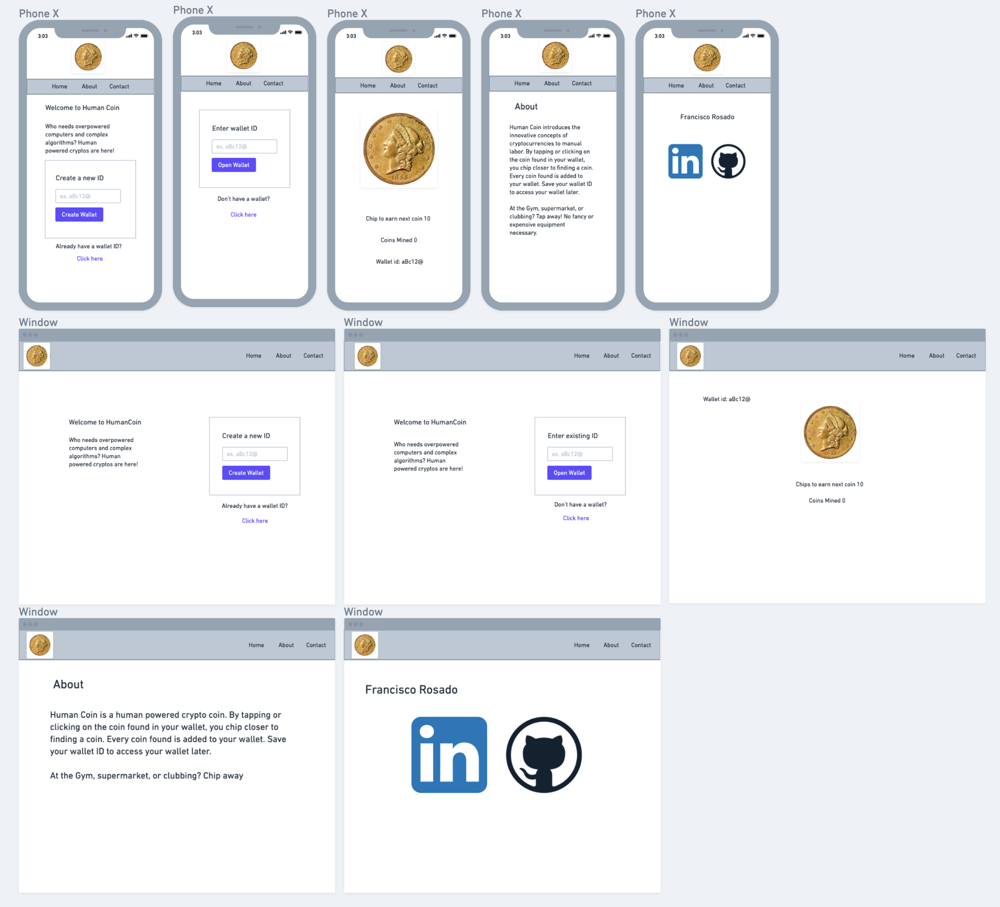
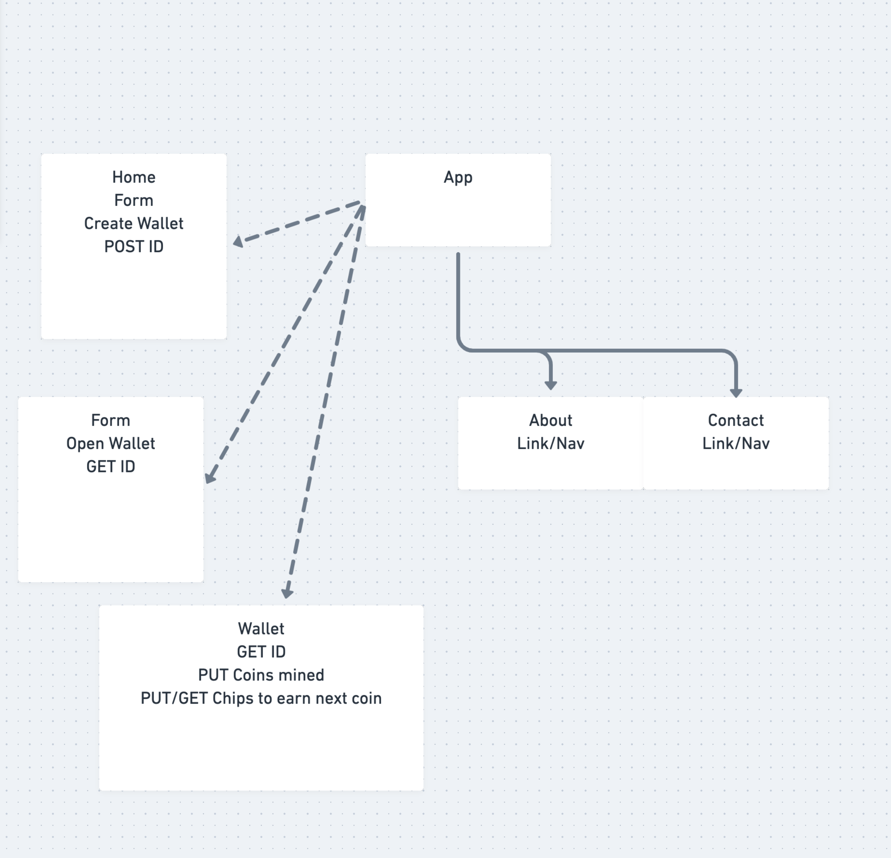

# Human Coin

https://human-coin.netlify.app

## Project Description

Human Coin is a React application that introduces the innovative concepts of cryptocurrencies to manual labor. By tapping or clicking on the coin found in your wallet, you chip closer to finding a coin. Every coin found is added to your wallet. Save your wallet ID to access your wallet later.

## Wireframes




## Component Hierarchy



## API and Data Sample

https://airtable.com/appwSNnRvlbsz27yj

Airtable is returning the data for this base as follows:

```
{
    "records": [
        {
            "id": "recaeUa2Cm9NmUdF6",
            "fields": {
                "id": "aBc12@",
                "balance": 0,
                "chips": 10
            },
            "createdTime": "2021-08-19T19:43:00.000Z"
        }
    ]
}

```

#### MVP

- App as a container component.
- Home component will contain a form to create a wallet and POST it to the API.
- If user already has a wallet key, GET wallet from API.
- In wallet component, mine for coins by clicking on coin button with a save function and POST changes to wallet balance to API.
- Navigation will have two components. About and Contact


#### PostMVP

- Check for robots
- Coin transfers

## Project Schedule

| Day      | Deliverable                                      | Status   |
| -------- | ------------------------------------------------ | -------- |
| Aug 20   | Project approval                                 | Complete |
| Aug 23   | Create and Route components for GET / POST wallet| Complete |
| Aug 24   | Create wallet component / clicking algo          | Complete |
| Aug 25   | CSS (attempt to bootstrap, else flexbox)         | Complete |

## Timeframes

| Component                 | Priority | Estimated Time | Time Invested | Actual Time |
| ------------------------- | :------: | :------------: | :-----------: | :---------: |
| Proposal                  |    H     |      2hrs      |     8hrs      |    8hrs     |
| Airtable / Github setup   |    H     |     1hrs       |      .5hr     |     .5hr    |
| "Create Wallet" Form      |    H     |      4hrs      |     5hrs      |    5hrs     |
| "Open Wallet" Form        |    H     |      4hrs      |     4hrs      |    4hrs     |
| "Mining" component and Algo|    H    |      4hrs      |     12hrs      |    12hrs     |
| CSS                       |    H     |     12hrs      |     1hrs      |    1hrs     |
| Total                     |    H     |    27          |     30.5hrs     |    30.5hrs    |

## SWOT Analysis

### Strengths:

I think that I have a good understanding of CSS and JavaScript. So hopefully I can get the algo for the number of chips and styling done quickly for MVP requirements

### Weaknesses:

Can implement toggle but don't fully understand it, same for prevstate.

### Opportunities:

This project will give me enough time to review documentation. Obtain a fundamental understanding of the concepts learned in class and fill knowledge gaps. I am also looking forward to post-mvp to get a chance to play with React.

### Threats:

Knowledge gaps and weaknesses mentioned above.
